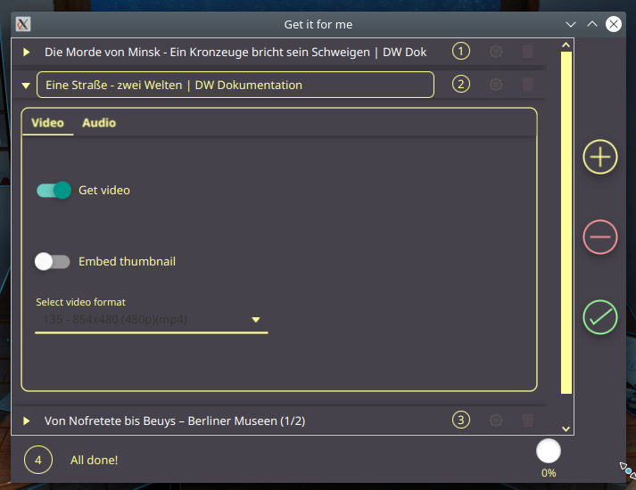
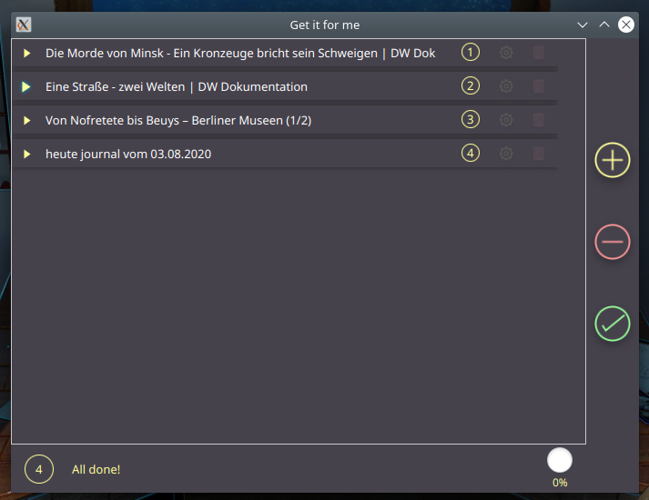

# gifme
An ui to use the CLI program YouTube-dll for downloading videos on YouTube and other video platforms.

# What next?
More is coming soon in the new update. This project was just a way for me to learn more about javafx to later use it to build nore complex apps :)
